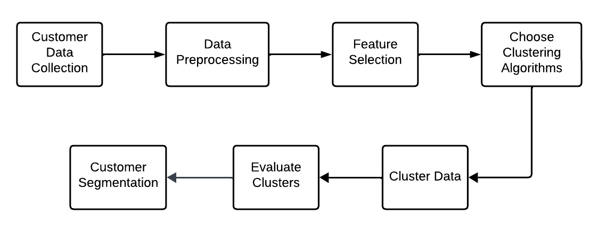

# Customer Personality Analysis

## Overview

This project focuses on analyzing customer personalities using various clustering algorithms to segment customers based on their behavioral patterns and characteristics. The analysis helps businesses better understand their customer base and tailor their marketing strategies accordingly.

_Customer segmentation workflow_

## Algorithms Used

- K-means Clustering
- Agglomerative Clustering
- DBSCAN (Density-Based Spatial Clustering of Applications with Noise)
- Affinity Propagation

## Key Features

- Data preprocessing and cleaning
- Implementation of multiple clustering algorithms
- Model evaluation and comparison
- Visualization of results

## Getting Started

1. Clone this repository
2. Install required dependencies
3. Run the clustering algorithms

## Results

Detailed analysis and comparison of different clustering algorithms' performance in customer segmentation.
